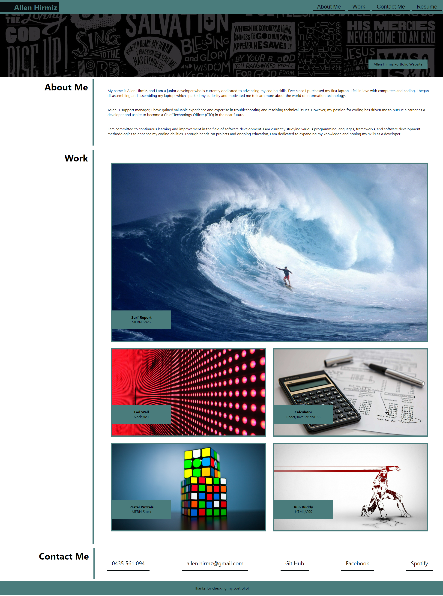
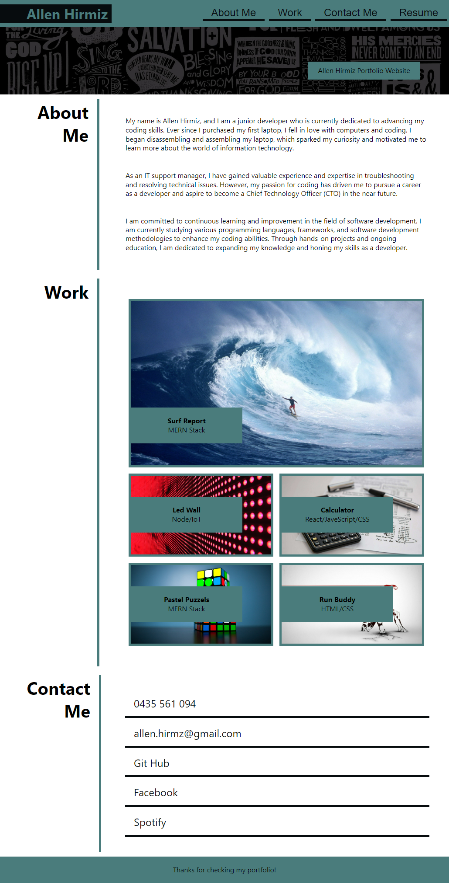
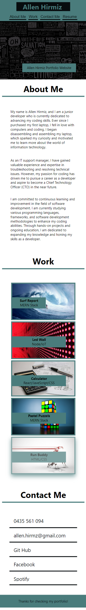

# Protfolio-Website-Advanced-CSS

## Portfolio Website
This repository contains the code and assets for my personal portfolio website. The website showcases my projects, skills, and experiences to potential clients, employers, and collaborators. It serves as a central hub for sharing my work and establishing a professional online presence.
This project is mainly focused on showing up my skills in CSS and HTML coding, and to improve on it as I progress through my learning journey.

## GitHub Repo URL
https://github.com/dingogap/Fit-Connect-Pro

## Website URL
https://allenhirmiz.github.io/Protfolio-Website-Advanced-CSS/main/

## Table of Contents
Navigation menu
Cover photo
About Me
Upcoming projects
Contact Me
Footer

The portfolio website is designed to provide an overview of my professional background, highlight my skills and expertise, and showcase the projects I have worked on. It offers a clean and intuitive user interface to navigate through different sections, view project details, and get in touch with me.

## Installation
Web Based
## Technologies Used
The portfolio website is built using the following technologies:

HTML5: The structure and layout of the web pages.
CSS3: Styling and visual enhancements for an appealing user interface.
JavaScript: Dynamic and interactive elements, such as animations and form validation.
Git: Version control system for managing codebase changes.
GitHub Pages: Hosting service for deploying the website.
## Mock-Up

The following image shows the web application's appearance and functionality:

## Desktop Layout

## Tablet Layout

## Mobile Layout

